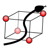
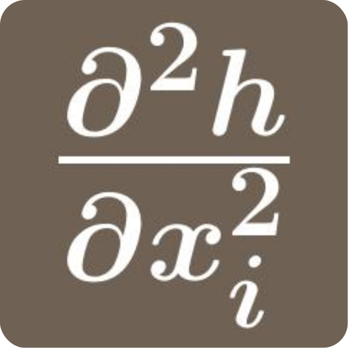
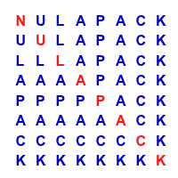

# Projects

-   :fontawesome-brands-github: **bb**

    ---

    A Bitbucket CLI and SDK client.

    [:fontawesome-brands-github: GitHub](https://github.com/eggzec/bb)

-   :fontawesome-brands-github: **vatic**

    ---

    Open-source risk analysis with predictive modeling and Monte Carlo
    simulation for uncertainty workflows.

    [:fontawesome-brands-github: GitHub](https://github.com/eggzec/vatic)

-   <strong>qtop</strong>

    ---

    Text-mode HPC queue monitor for PBS, SGE, and OAR clusters.

    [:fontawesome-solid-book: Documentation](https://eggzec.github.io/qtop/)
    &nbsp; [:fontawesome-brands-github: GitHub](https://github.com/eggzec/qtop)

-   <strong>pyswarm</strong>

    ---

    Particle Swarm Optimization (PSO) for Python with a lightweight API for
    constrained, gradient-free optimization.

    [:fontawesome-solid-book: Documentation](https://eggzec.github.io/pyswarm/)
    &nbsp; [:fontawesome-brands-github: GitHub](https://github.com/eggzec/pyswarm)

-   <strong>pydoe</strong>

    ---

    Design of Experiments package for Python with factorial,
    response-surface, space-filling, and optimal design methods.

    [:fontawesome-solid-book: Documentation](https://pydoe.github.io/pydoe/)
    &nbsp; [:fontawesome-brands-github: GitHub](https://github.com/pydoe/pydoe)

-   <strong>mcerp</strong>

    ---

    Real-time Monte Carlo error propagation for Python using
    latin-hypercube sampling.

    [:fontawesome-solid-book: Documentation](https://eggzec.github.io/mcerp/)
    &nbsp; [:fontawesome-brands-github: GitHub](https://github.com/eggzec/mcerp)

-   <strong>soerp</strong>

    ---

    Second-order error propagation for Python to track uncertainty through
    mathematical models using distribution moments.

    [:fontawesome-solid-book: Documentation](https://eggzec.github.io/soerp/)
    &nbsp; [:fontawesome-brands-github: GitHub](https://github.com/eggzec/soerp)

-   <strong>ad</strong>

    ---

    First- and second-order automatic differentiation for Python with
    transparent numerical operations.

    [:fontawesome-solid-book: Documentation](https://pythonhosted.org/ad/)
    &nbsp; [:fontawesome-brands-github: GitHub](https://github.com/eggzec/ad)

-   :fontawesome-brands-github: **sdepack**

    ---

    Stochastic Runge-Kutta solvers for scalar Ito SDEs, from Euler-Maruyama
    to higher-order schemes.

    [:fontawesome-solid-book: Documentation](https://eggzec.github.io/sdepack/)
    &nbsp; [:fontawesome-brands-github: GitHub](https://github.com/eggzec/sdepack)

-   :fontawesome-brands-github: **smolpack**

    ---

    Multidimensional cubature over `[0,1]^d` using Smolyak sparse-grid
    construction with Clenshaw-Curtis rules.

    [:fontawesome-solid-book: Documentation](https://eggzec.github.io/smolpack/)
    &nbsp; [:fontawesome-brands-github: GitHub](https://github.com/eggzec/smolpack)

-   <strong>NULAPACK</strong>

    ---

    Numerical linear algebra package with Fortran core subroutines and
    Python/C++ interfaces.

    [:fontawesome-solid-book: Documentation](https://nulapack.github.io/NULAPACK/)
    &nbsp; [:fontawesome-brands-github: GitHub](https://github.com/NULAPACK/NULAPACK)

-   :fontawesome-brands-github: **polpack**

    ---

    High-performance special functions and polynomial families with a
    Fortran numerical core.

    [:fontawesome-solid-book: Documentation](https://eggzec.github.io/polpack/)
    &nbsp; [:fontawesome-brands-github: GitHub](https://github.com/eggzec/polpack)

-   :fontawesome-brands-github: **kronrod**

    ---

    Gauss-Kronrod quadrature rule generator for reusable high-accuracy
    numerical integration.

    [:fontawesome-solid-book: Documentation](https://eggzec.github.io/kronrod/)
    &nbsp; [:fontawesome-brands-github: GitHub](https://github.com/eggzec/kronrod)

-   :fontawesome-brands-github: **sparse_grid**

    ---

    Pure-Python sparse grid implementation with hierarchical index generation
    and fast hat-basis evaluation.

    [:fontawesome-solid-book: Documentation](https://eggzec.github.io/sparse_grid/)
    &nbsp; [:fontawesome-brands-github: GitHub](https://github.com/eggzec/sparse_grid)

-   :fontawesome-brands-github: **cordic**

    ---

    CORDIC-based trigonometric, hyperbolic, exponential, logarithmic, and
    root-function evaluation library for Python.

    [:fontawesome-solid-book: Documentation](https://eggzec.github.io/cordic/)
    &nbsp; [:fontawesome-brands-github: GitHub](https://github.com/eggzec/cordic)

-   <strong>deltaFlow</strong>

    ---

    Command-line power-flow analysis tool for electrical systems using
    Gauss-Seidel and Newton-Raphson solvers.

    [:fontawesome-solid-book: Documentation](https://eggzec.github.io/deltaFlow/)
    &nbsp; [:fontawesome-brands-github: GitHub](https://github.com/eggzec/deltaFlow)

-   <strong>JavaDOE</strong>

    ---

    Java Design of Experiments library including Box-Behnken, central
    composite, and factorial designs.

    [:fontawesome-brands-github: GitHub](https://github.com/Java-DOE/JavaDOE)

-   :fontawesome-brands-github: **qweb**

    ---

    Web interface for Sun Grid Engine with job submission, monitoring, and
    cluster management endpoints.

    [:fontawesome-brands-github: GitHub](https://github.com/eggzec/qweb)

## Work In Progress (WIP)

-   :fontawesome-brands-github: **pyact**

    ---

    Python wrapper around `nektos/act` for local GitHub Actions workflows.

    [:fontawesome-brands-github: GitHub](https://github.com/laraibg786/pyact)

-   :fontawesome-brands-github: **pydanticInput**

    ---

    Input-validation utility project built around Pydantic, currently under
    active development.

    [:fontawesome-brands-github: GitHub](https://github.com/laraibg786/pydanticInput)

-   :fontawesome-brands-github: **codeCurfew**

    ---

    Go-based tooling project currently in progress.

    [:fontawesome-brands-github: GitHub](https://github.com/laraibg786/codeCurfew)

-   :fontawesome-brands-github: **permit**

    ---

    License as a Service MVP exploring programmatic license issuance and
    verification flows.

    [:fontawesome-brands-github: GitHub](https://github.com/eggzec/permit)

